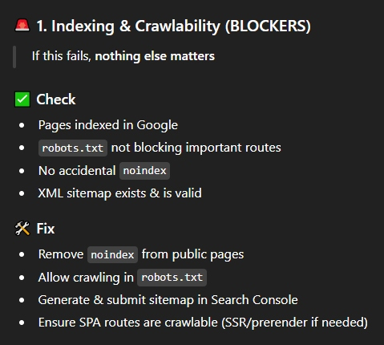
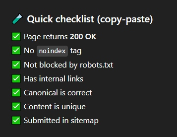
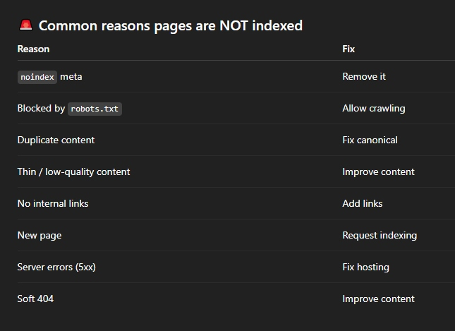
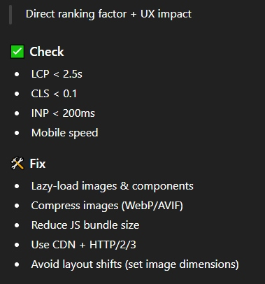
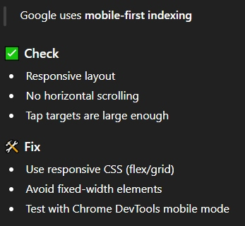
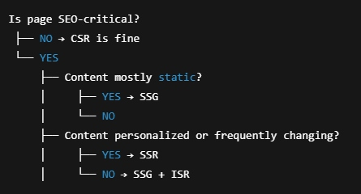
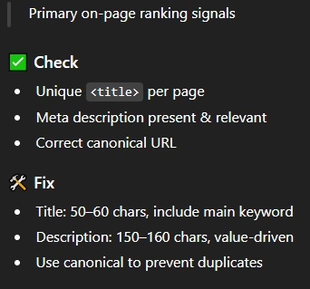

# 🧭 SEO Audit Checklist (Priority-First)



--

## 🧰 SEO Tools (Always Verify with GSC)
- 🔍 https://search.google.com/search-console
- 🧠 https://app.ahrefs.com  
- 🧪 https://technicalseo.com/tools/
- 🧬 https://schemagenerator.tools/
- 🏢 https://business.google.com  
  📣 Connect **Google Business Profile** (local SEO)
- 🧾 Crawl audit: https://github.com/nikolav/utils-crawl-audit.git
- ✅ Schema validation (official):  
  https://developers.google.com/search/docs/appearance/structured-data
- 📊 CWV reference: https://web.dev/articles/vitals


## ⚙ tooling for optimal seo, @nuxt
"optimal SEO" nuxt stack, similar for other platforms
Marketing site / blog (SSR or prerender)
- @nuxtjs/seo
- nuxt-security
- @nuxtjs/fontaine
- @sentry/nuxt (optional but recommended)
  - Multilingual marketing site
      - all above + @nuxtjs/i18n

--

## 🚨 1. Indexing & Crawlability (BLOCKER)
> If this fails, nothing else matters.

### ✅ Check
- 🔍 Google index test  
  `site:https://domain.com/path`
- 🔎 Google Search Console
  - URL Inspection
  - Pages → Indexing report
  - Sitemap coverage  
    **Indexed / Submitted ratio**
    - Low ratio = crawl/index issue
- 📄 Manual content check  
  Search an **exact sentence** from page in Google




### 🛠 Fix
- 🤖 `robots.txt` does **not** block important routes
- ❌ No `noindex` on public pages
- ✅ Self-canonical URLs
- 🗺 XML sitemap exists & valid  
  ```bash
  curl -sSIL https://domain.com/sitemap.xml | sed -n '1,20p'
  ```
- 📤 Submit sitemap in GSC
- ⚙️ SPA apps:
  - SSR / prerender enabled
  - Routes return **HTML with content**

--

## ⚡ 2. Performance & Core Web Vitals


- 📊 Test: https://pagespeed.web.dev/
- 🖼 Lazy-load images & components
- 🧊 Use WebP / AVIF
- 📦 Reduce JS bundle size
- 🌍 CDN + HTTP/2/3
- 📐 Set width/height to prevent CLS

--

## 📱 3. Mobile-Friendliness


- 🧪 Lighthouse (Chrome DevTools → F12)
- 📱 Checklist:
  - Responsive layout
  - `<meta viewport>`
  - No horizontal scroll
  - Font ≥ 16px
  - Tap targets ≥ 48px
  - LCP < 2.5s on mobile

--

## 🧱 4. Rendering Strategy (JS Apps)


- CSR → Worst for SEO
- SSR → Best general choice
- SSG → Best SEO if possible
- Hybrid / ISR → Modern sweet spot

--

## 🏷️ 5. Titles, Meta & Head Tags


- `<title>`: 50–60 chars, keyword first
- Meta description: 150–160 chars, value-focused
- Canonical: prevent duplicate URLs

--

## 🧠 6. Content Quality & Search Intent
> Google ranks answers, not keywords.

- Expand thin pages
- Merge pages with same intent
- Answer real user questions
- Refresh outdated content

--

## 🧩 7. Headings & Semantic Structure
- One clear `<h1>`
- Logical heading hierarchy
- Replace div-soup with semantic HTML

--

## 🖼️ 8. Image SEO
- Meaningful `alt` text
- Compression
- Modern formats
- Lazy-load offscreen images

--

## 🔗 9. Internal Linking
- Contextual internal links
- Breadcrumb navigation
- Fix broken links

--

## 🌍 10. URL Structure & Routing
- Human-readable URLs
- Consistent trailing slashes
- 301 redirect duplicates

--

## 🔐 11. Security & Trust Signals
trust and compliance
- 🔒 HTTPS enforced + 301
- 🚫 No mixed content
- 🛡 Security headers:
  ```http
  Strict-Transport-Security: max-age=31536000; includeSubDomains
  Content-Security-Policy: upgrade-insecure-requests
  X-Content-Type-Options: nosniff
  ```
  - nuxt module: Nuxt Security

--

## 🧬 12. Structured Data (Schema)
- Add only visible content schemas
- Validate with Rich Results Test
- Golden rule:
  > If users can’t see it — don’t schema it

--

## 🌐 13. International / Local SEO
- Correct `hreflang`
- Localized content
- Optimized Google Business Profile

--

## 📊 14. Analytics & Monitoring
- Google Analytics
- Google Search Console
- Monitor coverage, CWV, rankings & CTR

--

## 🔢 Priority Order
1️⃣ Indexing  
2️⃣ Performance  
3️⃣ Mobile  
4️⃣ Rendering  
5️⃣ Meta & Content  
6️⃣ Structure & Links  
7️⃣ Enhancements & Monitoring
